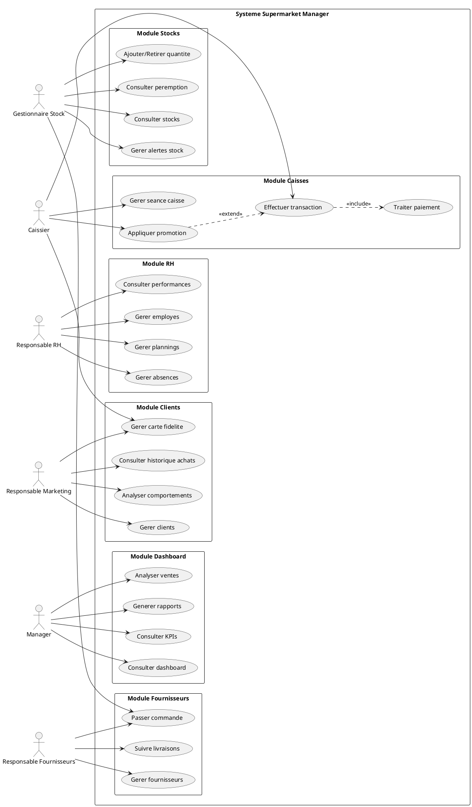

# Diagramme de Cas d'Utilisation - Supermarket Manager

## Acteurs

### 1. Gestionnaire de Stock
- Consulter les stocks
- Ajouter/Retirer des quantites
- Gerer les alertes de stock
- Consulter les produits proches de peremption
- Passer des commandes fournisseurs
- Gerer les entrepots

### 2. Caissier
- Ouvrir/Fermer une seance de caisse
- Effectuer des transactions
- Appliquer des promotions
- Gerer les paiements (especes, carte, mobile)
- Imprimer les recus
- Consulter les transactions

### 3. Responsable RH
- Gerer les employes (CRUD)
- Creer/Modifier les plannings
- Gerer les absences/conges
- Consulter les performances
- Valider les demandes d'absence

### 4. Responsable Marketing
- Gerer les clients
- Gerer les cartes de fidelite
- Consulter l'historique des achats
- Creer des promotions
- Analyser les comportements clients

### 5. Manager/Directeur
- Consulter le dashboard
- Analyser les ventes
- Consulter les rapports financiers
- Analyser les produits les plus vendus
- Consulter les heures de pointe
- Gerer les marges par categorie

### 6. Responsable Fournisseurs
- Gerer les fournisseurs (CRUD)
- Passer des commandes
- Suivre les livraisons
- Gerer les relations fournisseurs

## Cas d'Utilisation Principaux

### Module Gestion des Stocks
1. **Consulter les stocks**
   - Acteur: Gestionnaire de Stock
   - Precondition: Etre authentifie
   - Postcondition: Liste des stocks affichee

2. **Gerer les alertes de stock**
   - Acteur: Gestionnaire de Stock
   - Description: Recevoir des alertes quand stock < seuil

3. **Passer une commande fournisseur**
   - Acteur: Gestionnaire de Stock, Responsable Fournisseurs
   - Include: Selectionner fournisseur, Ajouter produits

### Module Caisses
4. **Effectuer une transaction**
   - Acteur: Caissier
   - Precondition: Seance de caisse ouverte
   - Include: Scanner produits, Calculer total, Traiter paiement

5. **Gerer une seance de caisse**
   - Acteur: Caissier
   - Description: Ouvrir/Fermer la caisse, Declarer fond de caisse

### Module RH
6. **Gerer les plannings**
   - Acteur: Responsable RH
   - Description: Creer/Modifier plannings hebdomadaires

7. **Gerer les absences**
   - Acteur: Responsable RH, Employe
   - Description: Demander/Valider conges et absences

### Module Clients et Fidelite
8. **Gerer carte de fidelite**
   - Acteur: Responsable Marketing, Caissier
   - Description: Creer carte, Crediter/Debiter points

9. **Analyser comportements clients**
   - Acteur: Responsable Marketing
   - Description: Consulter historique, Identifier preferences

### Module Dashboard et Reporting
10. **Consulter le dashboard**
    - Acteur: Manager
    - Description: Vue d'ensemble des KPIs

11. **Generer des rapports**
    - Acteur: Manager
    - Description: Rapports ventes, stocks, RH

### Module Fournisseurs
12. **Gerer les fournisseurs**
    - Acteur: Responsable Fournisseurs
    - Description: CRUD fournisseurs, Suivre commandes

## Relations entre Cas d'Utilisation

### Relations Include
- "Effectuer une transaction" **include** "Calculer total"
- "Effectuer une transaction" **include** "Traiter paiement"
- "Passer commande fournisseur" **include** "Selectionner fournisseur"
- "Gerer carte fidelite" **include** "Consulter client"

### Relations Extend
- "Appliquer promotion" **extend** "Effectuer une transaction"
- "Generer alerte stock" **extend** "Consulter stocks"
- "Imprimer recu" **extend** "Effectuer une transaction"

## Diagramme PlantUML

## Flux Principaux

### Flux 1: Transaction de vente
1. Caissier ouvre seance
2. Caissier scanne produits
3. Systeme calcule total
4. Client paye
5. Systeme met a jour stock
6. Systeme credite points fidelite
7. Systeme imprime recu

### Flux 2: Reapprovisionnement
1. Systeme detecte stock faible
2. Systeme genere alerte
3. Gestionnaire consulte alertes
4. Gestionnaire passe commande
5. Fournisseur livre
6. Gestionnaire met a jour stock

### Flux 3: Gestion absence
1. Employe demande conge
2. Systeme notifie RH
3. RH valide/refuse
4. Systeme met a jour planning
5. Systeme notifie employe

