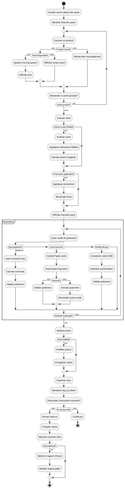
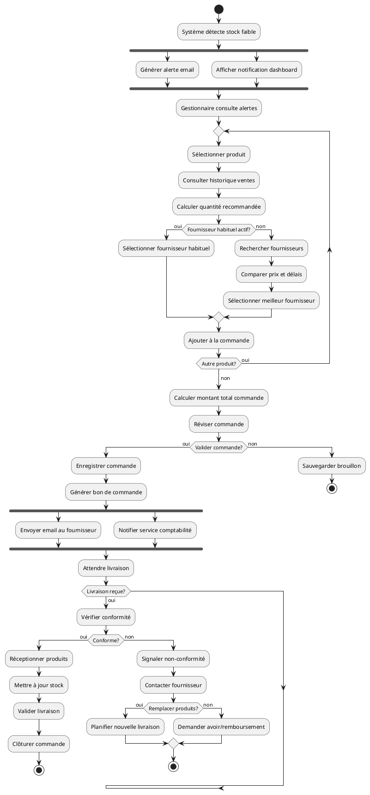
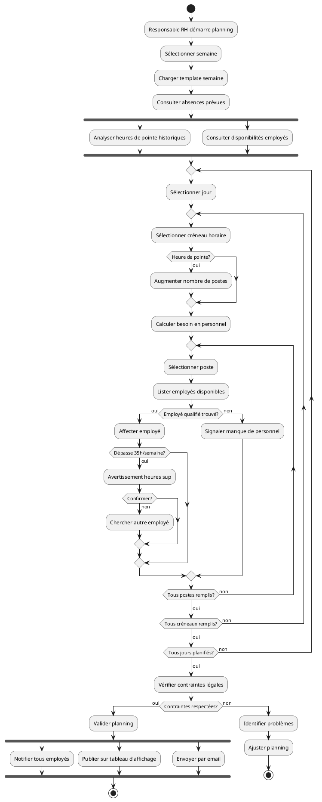
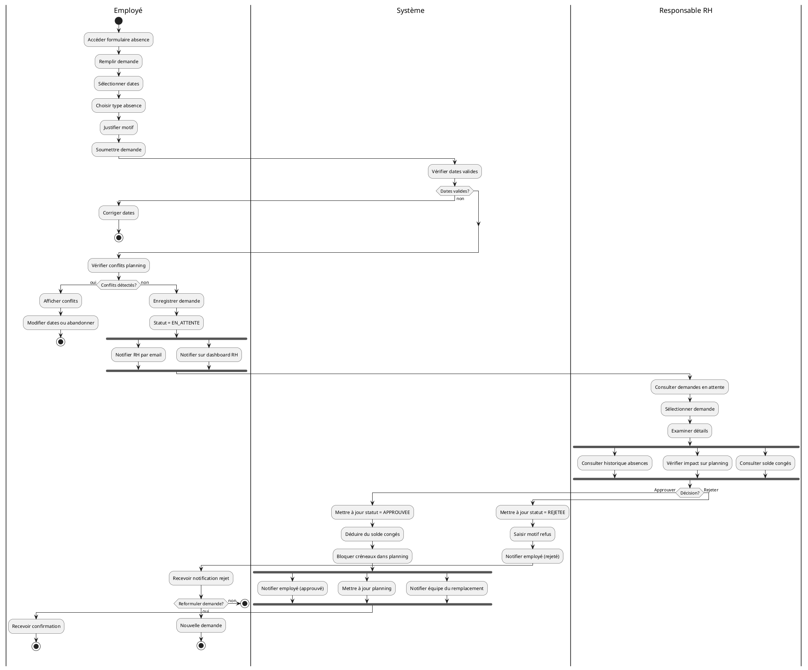
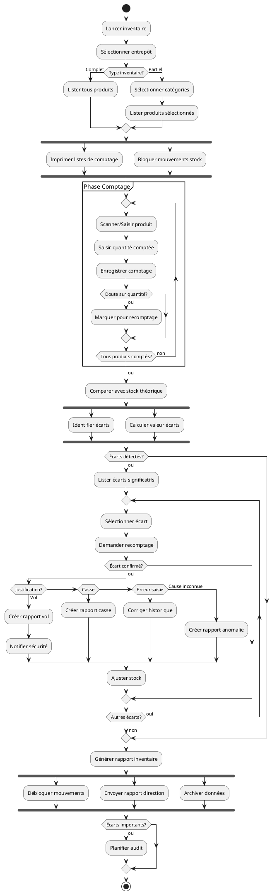

# Diagramme d'Activité - Supermarket Manager

## 1. Activité: Processus de Vente Complète



## 2. Activité: Gestion de Commande Fournisseur



## 3. Activité: Planification Hebdomadaire



## 4. Activité: Traitement Demande Absence



## 5. Activité: Gestion Carte Fidélité

```plantuml
@startuml
|Client|
start
:Demander carte fidélité;

|Caissier|
:Vérifier éligibilité;

if (Client déjà inscrit?) then (oui)
  :Rechercher client;
  
  if (A déjà carte?) then (oui)
    :Informer client;
    stop
  endif
else (non)
  :Créer compte client;
  :Saisir informations;
  :Valider données;
endif

|Système|
:Générer numéro carte unique;
:Définir niveau = BRONZE;
:Points = 0;
:Date expiration = +2 ans;
:Activer carte;

fork
  :Enregistrer en base;
fork again
  :Envoyer email bienvenue;
end fork

|Caissier|
:Imprimer carte;
:Expliquer fonctionnement;

|Client|
:Recevoir carte;

note right
  La carte est maintenant utilisable
  pour tous les achats
end note

== Utilisation Achat ==

|Client|
:Faire courses;
:Présenter carte en caisse;

|Caissier|
:Scanner carte;

|Système|
:Récupérer informations;
:Afficher solde points;

if (Carte valide et active?) then (oui)
  :Associer à transaction;
  
  |Caissier|
  :Finaliser vente;
  
  |Système|
  :Calculer points (1pt/100F CFA);
  :Créditer points;
  :Enregistrer historique;
  
  :Vérifier seuil niveau supérieur;
  
  if (Atteint seuil?) then (oui)
    :Upgrader niveau;
    
    fork
      :Notifier client;
    fork again
      :Envoyer email félicitations;
    end fork
  endif
  
  |Caissier|
  :Informer client des points;
  
  |Client|
  :Noter nouveau solde;
  stop
  
else (non)
  |Système|
  if (Expirée?) then (oui)
    :Proposer renouvellement;
  else (Désactivée)
    :Expliquer raison;
  endif
  
  stop
endif

@enduml
```

## 6. Activité: Contrôle Stock et Inventaire



## Description des Activités

### 1. Processus de Vente
- Ouverture de séance avec déclaration du fond de caisse
- Scan des produits avec vérification de stock
- Application des promotions et réductions fidélité
- Gestion de paiements multiples
- Fermeture de séance avec calcul d'écart

### 2. Commande Fournisseur
- Détection automatique des stocks faibles
- Calcul de la quantité recommandée
- Sélection du meilleur fournisseur
- Suivi de la livraison
- Vérification de conformité

### 3. Planification RH
- Analyse des besoins (heures de pointe)
- Affectation des employés selon disponibilités
- Respect des contraintes légales (35h)
- Notification de tous les employés

### 4. Demande Absence
- Soumission par l'employé
- Vérification automatique des conflits
- Validation/Rejet par RH
- Mise à jour automatique du planning

### 5. Carte Fidélité
- Création avec génération de numéro unique
- Utilisation lors des achats
- Calcul et crédit automatique de points
- Upgrade automatique de niveau

### 6. Inventaire
- Comptage physique vs stock théorique
- Identification et analyse des écarts
- Justification et ajustement
- Génération de rapports

