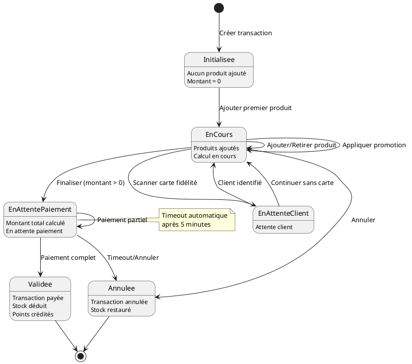
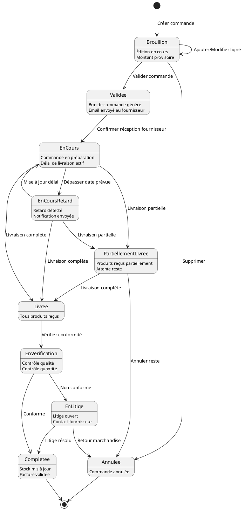
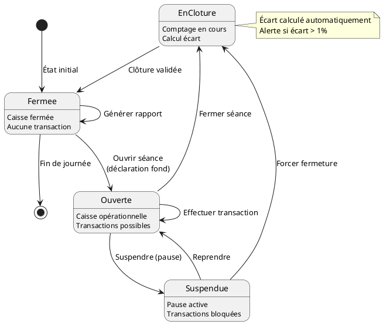
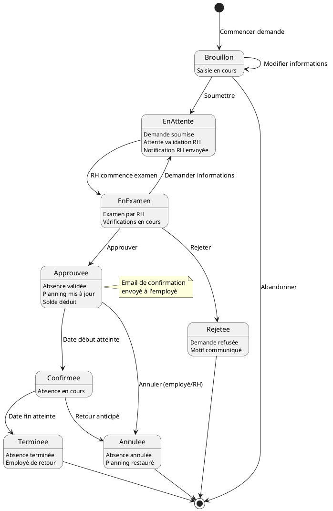
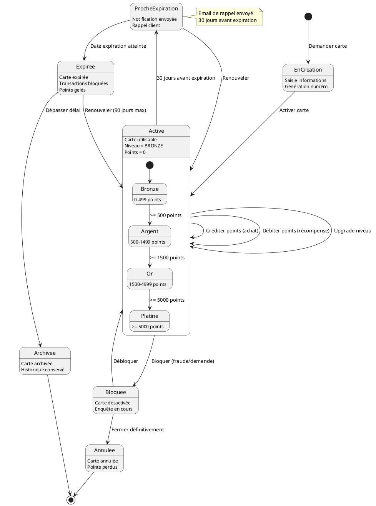
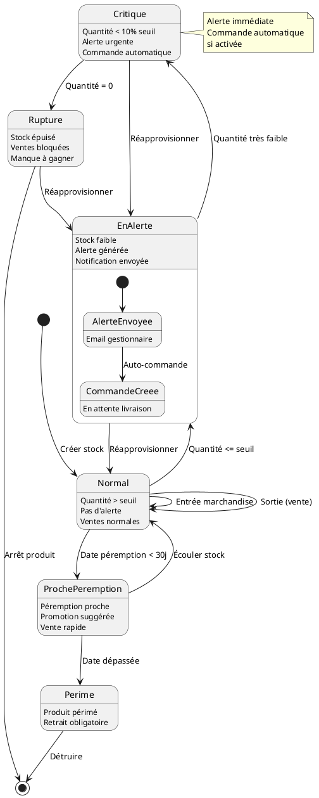
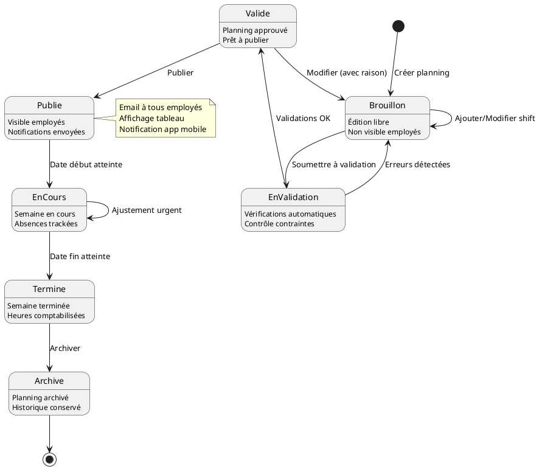

- **En Cours**: Préparation par fournisseur
- **Livrée**: Marchandise reçue
- **Complétée**: Vérifiée et stock mis à jour

### Séance de Caisse
- **Fermée**: Caisse inactive
- **Ouverte**: Opérationnelle pour transactions
- **Suspendue**: Pause temporaire
- **En Clôture**: Comptage et fermeture

### Demande Absence
- **Brouillon**: Saisie en cours
- **En Attente**: Soumise, attente validation
- **Approuvée**: Validée par RH
- **Confirmée**: Absence en cours
- **Terminée/Rejetée/Annulée**: États finaux

### Carte Fidélité
- **Active**: Utilisable avec niveaux (Bronze → Platine)
- **Proche Expiration**: Rappel avant expiration
- **Expirée**: Nécessite renouvellement
- **Bloquée**: Temporairement désactivée
- **Annulée**: Fermée définitivement

### Stock
- **Normal**: Quantité suffisante
- **En Alerte**: Sous le seuil de réapprovisionnement
- **Critique**: Très faible (< 10% seuil)
- **Rupture**: Stock épuisé
- **Proche Péremption/Périmé**: États liés à la date

### Planning
- **Brouillon**: Création/Modification
- **En Validation**: Contrôles automatiques
- **Validé**: Approuvé, prêt à publier
- **Publié**: Visible par les employés
- **En Cours**: Semaine active
- **Terminé**: Semaine passée
- **Archivé**: Historique conservé
# Diagramme d'État - Supermarket Manager

## 1. États d'une Transaction

## 2. États d'une Commande Fournisseur

## 3. États d'une Séance de Caisse

## 4. États d'une Demande d'Absence

## 5. États d'une Carte de Fidélité

## 6. États d'un Stock

## 7. États d'un Planning

## Description des États

### Transaction
- **Initialisée**: Nouvelle transaction vide
- **En Cours**: Ajout de produits actif
- **En Attente Paiement**: Total calculé, attente paiement
- **Validée**: Transaction complète et payée
- **Annulée**: Transaction abandonnée

### Commande Fournisseur
- **Brouillon**: Édition en cours
- **Validée**: Bon de commande envoyé

