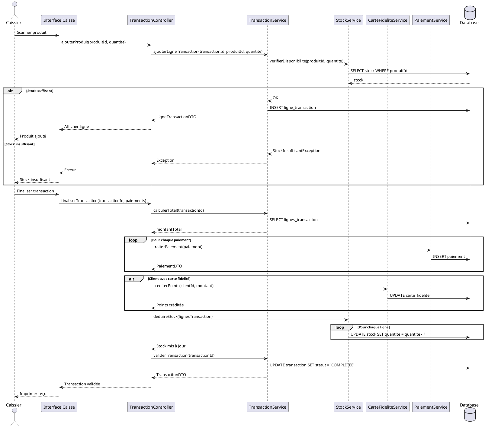
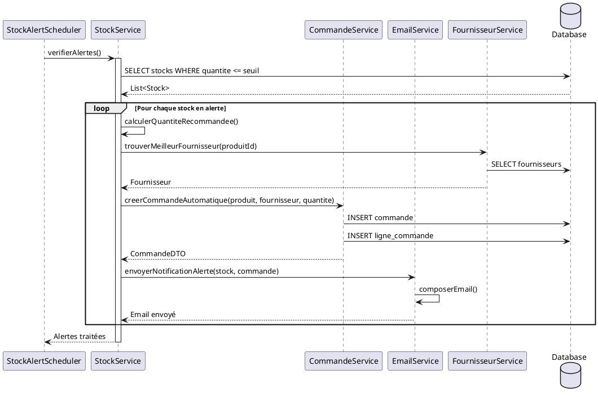
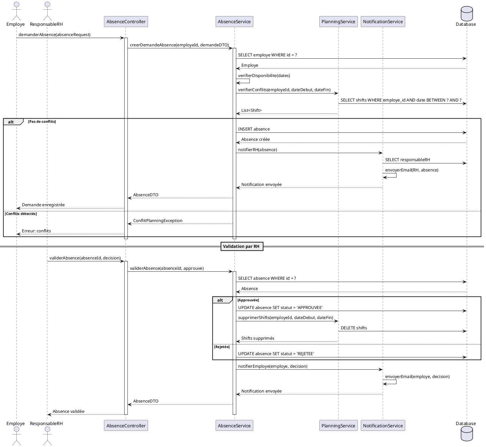
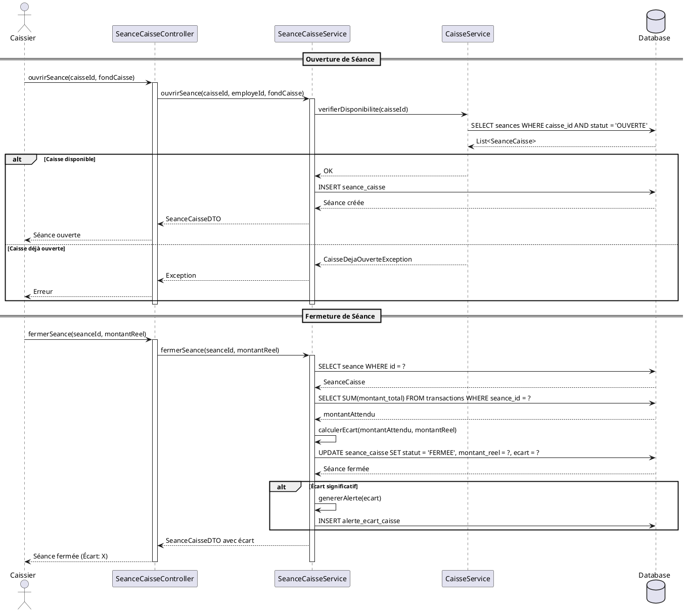
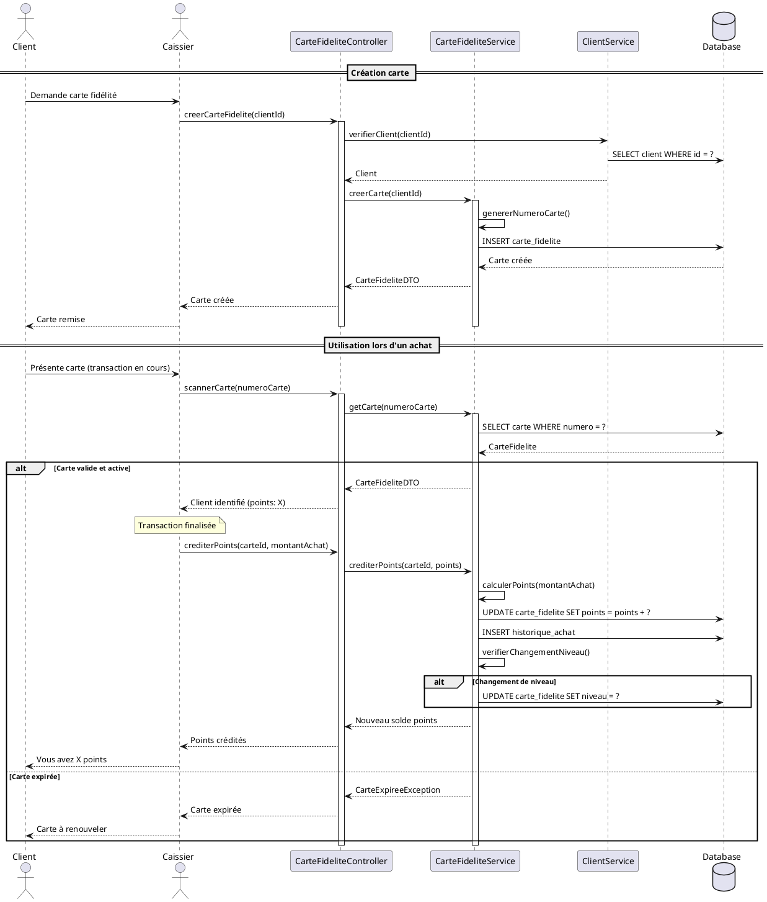

- Création avec numéro unique
- Utilisation lors des achats
- Calcul et crédit automatique de points
- Changement automatique de niveau
# Diagramme de Séquence - Supermarket Manager

## 1. Séquence: Effectuer une Transaction de Vente



## 2. Séquence: Réapprovisionnement Automatique



## 3. Séquence: Gestion des Absences



## 4. Séquence: Ouverture/Fermeture de Caisse



## 5. Séquence: Consultation Dashboard

```plantuml
@startuml
actor Manager
participant DashboardController
participant DashboardService
participant TransactionService
participant StockService
participant EmployeService
database Database

Manager -> DashboardController: getDashboard(periode)
activate DashboardController

DashboardController -> DashboardService: genererDashboard(dateDebut, dateFin)
activate DashboardService

par Chiffre d'affaires
    DashboardService -> TransactionService: calculerCA(dateDebut, dateFin)
    TransactionService -> Database: SELECT SUM(montant_total) FROM transactions
    TransactionService --> DashboardService: chiffreAffaires
and Nombre de transactions
    DashboardService -> TransactionService: compterTransactions(dateDebut, dateFin)
    TransactionService -> Database: SELECT COUNT(*) FROM transactions
    TransactionService --> DashboardService: nombreTransactions
and Produits les plus vendus
    DashboardService -> TransactionService: getProduitsLesPlusVendus(dateDebut, dateFin, limit)
    TransactionService -> Database: SELECT produit, SUM(quantite) ... GROUP BY produit ORDER BY ... LIMIT ?
    TransactionService --> DashboardService: List<ProduitVente>
and Alertes stock
    DashboardService -> StockService: getStocksEnAlerte()
    StockService -> Database: SELECT * FROM stocks WHERE quantite <= seuil
    StockService --> DashboardService: List<StockAlerte>
and Présences employés
    DashboardService -> EmployeService: getTauxPresence(dateDebut, dateFin)
    EmployeService -> Database: SELECT COUNT(*) FROM shifts ...
    EmployeService --> DashboardService: tauxPresence
end

DashboardService -> DashboardService: construireDashboardDTO()
DashboardService --> DashboardController: DashboardDTO

DashboardController --> Manager: Afficher dashboard

deactivate DashboardService
deactivate DashboardController

@enduml
```

## 6. Séquence: Gestion Carte Fidélité



## Description des Séquences

### 1. Transaction de Vente
- Scan de produits avec vérification stock
- Application de promotions
- Traitement de paiements multiples
- Crédit de points fidélité
- Déduction automatique du stock

### 2. Réapprovisionnement
- Vérification automatique programmée (scheduler)
- Détection des stocks sous le seuil
- Création automatique de commandes
- Notification par email

### 3. Gestion Absences
- Demande employé avec vérification conflits
- Notification RH
- Validation/Rejet
- Mise à jour planning

### 4. Ouverture/Fermeture Caisse
- Déclaration fond de caisse
- Calcul écart attendu/réel
- Génération d'alertes si écart important

### 5. Dashboard
- Requêtes parallèles pour performance
- Agrégation de données multiples
- Calculs de KPIs en temps réel

### 6. Carte Fidélité

